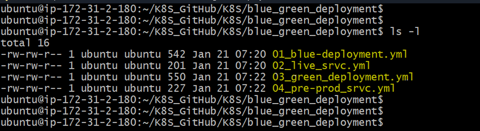
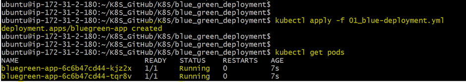

# 🚀 Blue-Green Deployment using Kubernetes

This project demonstrates a **Blue-Green Deployment strategy** using Kubernetes Deployments and Services to achieve **zero-downtime application releases**.

---

## 📑 Table of Contents

- [What is Blue-Green Deployment?](#-what-is-blue-green-deployment)
- [Technologies Used](#-technologies-used)
- [Project Structure](#-project-structure)
- [Step 1: Apply Kubernetes Manifests & Verify Pods & Services](#-step-1-apply-kubernetes-manifests)
- [Step 2: Verify Pods](#-step-2-verify-pods)
- [Step 3: Verify Services](#-step-3-verify-services)
- [Step 4: Before Switch (Blue Live, Green Pre-Prod)](#-step-4-before-switch-blue-live-green-pre-prod)
- [Step 5: Switch Live Traffic (Blue → Green)](#-step-5-switch-live-traffic-blue--green)
- [Step 6: After Switch Verification](#-step-6-after-switch-verification)
- [Rollback](#-rollback-green--blue)
- [Conclusion](#-conclusion)

---

## 📌 What is Blue-Green Deployment?

Blue-Green Deployment is a release strategy where:

- **Blue** → current production version  
- **Green** → new version deployed alongside Blue  
- Traffic is switched using a **Kubernetes Service selector**  
- Rollback is instant and safe  

---

## 🛠️ Technologies Used

- Kubernetes  
- Docker  
- kubectl  
- NodePort & LoadBalancer  
- VS Code  

---

## 📂 Project Structure

```text
.
├── 01_blue_deploy.yml
├── 02_live_service.yml
├── 03_green_deploy.yml
├── 04_preprod_service.yml
├── README.md



## Step 1: Apply Kubernetes Manifests & Verify Pods & Services

```
kubectl apply -f 01_blue_deploy.yml

kubectl get pods
```



